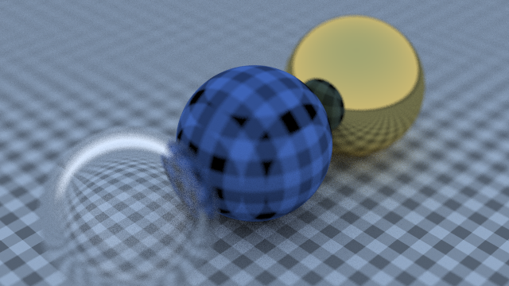

# Ray Tracing in One Weekend

This project is a Rust implementation of the "Ray Tracing in One Weekend" book by Pete Shirley. It demonstrates the basics of ray tracing, rendering a simple scene with spheres and materials such as Lambertian, Metal, and Dielectric.



## Table of Contents
- [Introduction](#introduction)
- [Usage](#usage)
- [Features](#features)
- [Scene Description](#scene-description)
- [Camera](#camera)
- [Materials](#materials)
- [Ray Tracing](#ray-tracing)
- [Rendering](#rendering)

## Introduction
Ray tracing is a rendering technique that simulates the behavior of light by tracing the path of rays through a scene. It can produce realistic images with accurate reflections, refractions, and shadows. This project focuses on the implementation of ray tracing using Rust programming language.

## Usage
To run the project, you need to have Rust installed on your system. Follow these steps:

1. Clone the repository:
   ```
   git clone https://github.com/wadetb/ray.git
   ```

2. Change into the project directory:
   ```
   cd ray
   ```

3. Build and run the project:
   ```
   cargo run
   ```

4. The rendered image will be printed in the PPM (Portable Pixmap) format to the console.

## Features
- Ray tracing implementation based on the "Ray Tracing in One Weekend" book
- Support for Lambertian, Metal, and Dielectric materials
- Scene description using spheres
- Camera with adjustable parameters
- Multisampling for anti-aliasing
- Reflection and refraction effects

## Scene Description
The scene is described using an array of spheres. Each sphere has a center point, radius, and material. The spheres are defined in the `SPHERES` constant array. You can modify this array to create different scenes.

## Camera
The camera is implemented with the `Camera` struct, allowing you to control the viewpoint and other parameters of the rendered image. It uses the concept of the virtual lens and generates rays for each pixel in the image.

## Materials
The project supports three types of materials:
- **Lambertian**: Diffuse material that scatters rays in random directions.
- **Metal**: Reflective material with adjustable fuzziness.
- **Dielectric**: Transparent material that refracts rays based on the incident angle.

Materials are defined in separate structs (`Lambertian`, `Metal`, `Dielectric`) and associated functions provide the behavior for scattering rays.

## Ray Tracing
The core of the ray tracing algorithm is implemented in the `ray_color` function. It recursively traces rays of light from the camera into the scene, calculating the color at each intersection point. This function accounts for reflection, refraction, and diffuse scattering of rays.

## Rendering
The rendering process is performed by the `main` function. It iterates over each pixel in the image and shoots multiple rays for each pixel to account for anti-aliasing. The final color for each pixel is calculated as an average of the colors obtained from the multiple rays. The resulting image is printed in the PPM format.

Feel free to explore and modify the code to create your own scenes or experiment with different materials and effects. Enjoy ray tracing in Rust!